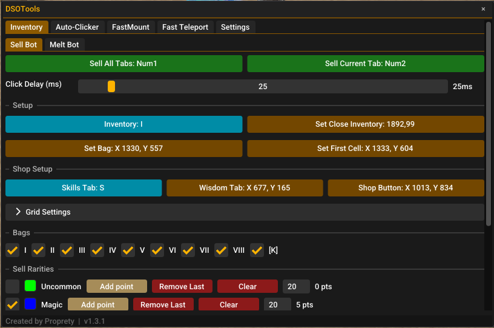
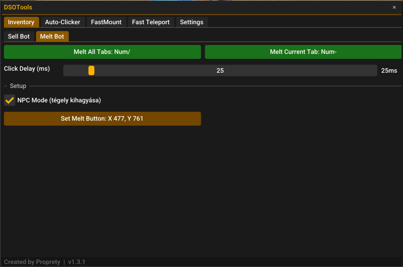
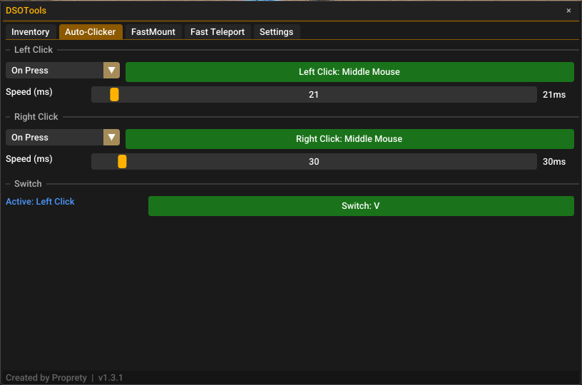
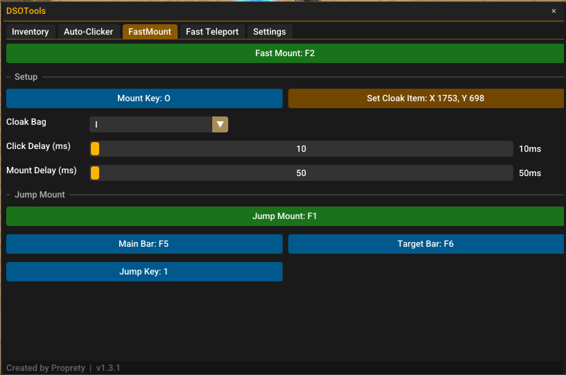
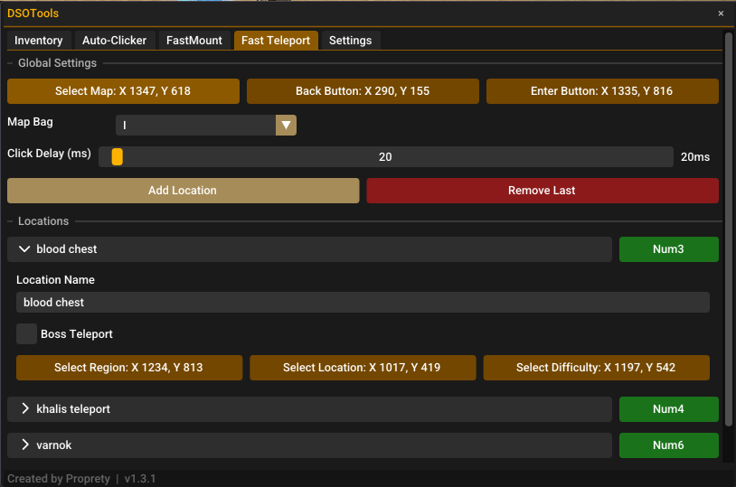
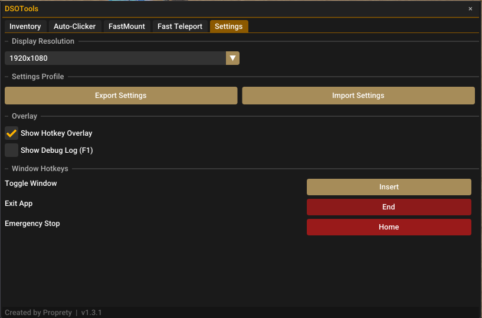
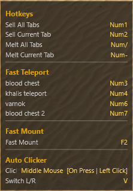

# DSOTools Documentation

  
  

DSOTools is a helper tool for DSO (Drakensang Online) that automates common inventory and navigation tasks. The tool runs as an always-on-top overlay and is controlled entirely via hotkeys.

---

## Table of Contents

1. [Getting Started](#getting-started)
2. [Global Controls](#global-controls)
3. [Inventory — Sell Bot](#inventory--sell-bot)
4. [Inventory — Melt Bot](#inventory--melt-bot)
5. [Auto-Clicker](#auto-clicker)
6. [Fast Mount](#fast-mount)
7. [Fast Teleport](#fast-teleport)
8. [Settings](#settings)
9. [Hotkey Overlay](#hotkey-overlay)
10. [Auto-Updater](#auto-updater)
11. [Tips & Troubleshooting](#tips--troubleshooting)

---

## Getting Started

1. Launch `DSOTools.exe` — a splash screen appears and checks for updates automatically.
2. The tool window appears on top of the game after the splash screen closes.
3. Use **Insert** to show/hide the window at any time.
4. Use **F1** to open/close the debug log panel (if enabled in Settings).
5. Press **Home** (Emergency Stop) to immediately cancel any running macro.
6. Press **End** to exit the application.

> All coordinates are set by clicking directly in the game while the picker overlay is active. Make sure the relevant game UI is open before setting coordinates.

---

## Global Controls

| Key | Action |
|-----|--------|
| Insert | Toggle tool window visibility |
| Home | Emergency Stop — cancel current macro |
| End | Exit DSOTools |
| F1 | Toggle debug log panel (if enabled in Settings) |

These keys can be rebound in the **Settings** tab.

---

## Inventory — Sell Bot

The Sell Bot scans your inventory bags and automatically sells items matching selected rarities.

### Setup

1. Open your inventory in-game.
2. Click **Inventory** key bind and press the key you use to open the inventory (default: `I`).
3. Click **Set Close Inventory** and click the red X button of the inventory window while it is open. This allows the bot to detect whether the inventory is open or closed.
4. Click **Set Bag** and click the first bag tab anchor point.
5. Click **Set First Cell** and click the top-left corner of the first inventory slot.

> **Important:** Set Close Inventory must be clicked while the inventory is open, and you must click directly on the red part of the close button for accurate color detection.

### Shop Setup

1. Click **Skills Tab** and press the key you use to open skills (default: `S`).
2. Click **Set Wisdom Tab** and click the Wisdom tab inside the skills window.
3. Click **Set Shop Button** and click the shop button.

### Grid Settings

The grid defines how the bot locates each inventory slot.

| Setting | Description |
|---------|-------------|
| Cell Width / Height | Size of each inventory slot in pixels |
| Cell Gap X / Y | Gap between slots in pixels (supports decimals, e.g. 5.4) |
| Bag Offset X | Horizontal pixel distance between bag tabs |
| Scan Level | `1 (Fast)` — single scan pass. `2 (Double pass)` — scans twice to catch missed items |
| Show Scan Grid | Toggles a debug overlay showing the slot grid and color point positions |

> **Tip:** Use the **Display Resolution** preset in Settings to automatically load the correct grid values for your screen resolution.

### Bags

Enable or disable each of the 9 bags (I–VIII + Crown). Disabled bags are skipped during Sell All Tabs.

### Sell Rarities

Each rarity (Uncommon, Magic, Rare, Epic, Unique, Set) can be toggled on/off.

**Adding color points:**

1. Enable the rarity.
2. Click **Add Point** and click directly on the colored question mark of an unidentified item of that rarity in your inventory.
3. Repeat from different slots to improve accuracy.
4. Use **Remove Last** or **Clear** to manage points.
5. The **tolerance** field (number next to point count) controls how strictly the color is matched.

> Points should be added from multiple slots and different positions within the slot for best results.

### Other Items

Custom items can be added alongside rarities. Each item has its own name, color points, and enable/disable toggle.

### Running the Sell Bot

- **Sell All Tabs** — opens the shop and sells all matching items across all enabled bags.
- **Sell Current Tab** — sells matching items on the currently open bag tab only.

A toast notification appears when selling is complete showing how many items were sold.

---

## Inventory — Melt Bot

The Melt Bot automates melting items in batches of 9.

### Modes

| Mode | Description |
|------|-------------|
| Normal | Uses the Crucible item from your inventory. Opens it automatically before each batch. |
| NPC Mode | Skips inventory and crucible — use this when standing at an NPC melter with the melt window already open. |

### Setup

1. Set **Click Delay** (ms between clicks).
2. If not using NPC Mode: click **Set Melt Item** and click the Crucible item in your inventory.
3. Click **Set Melt Button** and click the Melt button inside the melting window.

### Running

- **Melt All Tabs** — melts all matching items across all enabled bags.
- **Melt Current Tab** — melts matching items on the current tab only.

Items are processed in batches of 9. After each batch the Melt button is pressed automatically. Remaining items (fewer than 9) are melted at the end.

A toast notification appears when melting is complete showing how many items were melted.

---

## Auto-Clicker

Automates left and/or right mouse clicking at a configurable speed.

### Left Click / Right Click

| Setting | Description |
|---------|-------------|
| Mode | **On Press** — clicks while key is held. **Toggle** — first press starts, second press stops. |
| Hotkey | The key that activates clicking |
| Speed (ms) | Delay between clicks in milliseconds. Lower = faster. |

### Switch

Assign a **Switch** hotkey to toggle between Left Click and Right Click mode on the fly — without opening the tool window.

- The current active mode (Left Click / Right Click) is shown in the tool window and in the Hotkey Overlay.
- When a Switch key is set, only the Left Click hotkey is used — Switch toggles which type of click it performs.

> **Tip:** Bind both Left Click and Right Click to the same key (e.g. Middle Mouse) and set a Switch key for fast toggling between click types.

---

## Fast Mount

Automatically equips a speed cloak, mounts, then re-equips the original cloak. The mouse position is saved before and restored after the macro.

### Setup

1. Open your inventory and navigate to the bag containing your speed cloak.
2. Click **Mount Key** and press your mount hotkey (e.g. `O`).
3. Click **Set Cloak Item** and click the speed cloak in your inventory.
4. Select the correct **Cloak Bag** tab (I–VIII or Crown).
5. Adjust **Click Delay** and **Mount Delay** as needed.

> **Mount Delay** controls how long the macro waits after pressing the mount key before swapping the cloak back. Increase this if the mount animation is not completing.

### Jump Mount

Jump Mount is a special mode for classes that can mount while jumping, avoiding damage during the mount animation.

**Setup:**

| Setting | Description |
|---------|-------------|
| Jump Mount | Hotkey for the Jump Mount macro |
| Main Bar | The hotkey that selects your main skill bar |
| Target Bar | The hotkey that selects the skill bar containing the jump skill |
| Jump Key | The skill slot key (1–5) of the jump skill |

> Input is blocked during Jump Mount execution to prevent accidental clicks or keypresses from interfering.

---

## Fast Teleport

Automatically navigates to a saved map location. Supports both standard map teleports and boss teleport items.

### Global Setup

| Setting | Description |
|---------|-------------|
| Select Map | Click on your map item in the inventory |
| Back Button | Click the Back button in the map navigation UI |
| Enter Button | Click the Enter/Travel button |
| Click Delay | Delay between each click |
| Map Bag | Which inventory bag tab contains the map item |

### Adding Locations

1. Click **Add Location**.
2. Expand the location block and enter a name.
3. Set **Select Region**, **Select Location**, and optionally **Select Difficulty**.
4. Assign a hotkey to the location.

### Boss Teleport

Each location can be set as a Boss Teleport by checking the **Boss Teleport** checkbox inside the location block.

When enabled:
- **Select Region** and **Select Location** are not needed.
- Set **Boss Bag** — which inventory bag the boss teleport item is in.
- Set **Boss Item** — click the boss teleport item in your inventory.
- **Select Difficulty** and **Enter Button** work the same as normal teleport.

**Boss Teleport flow:**
1. Opens inventory if needed.
2. Switches to the Boss Bag tab.
3. Right-clicks the boss item to open the difficulty selector.
4. Selects the difficulty (if set).
5. Presses Enter to travel.

### Running

Press the assigned hotkey for a location. The macro handles inventory open/close automatically.

---

## Settings

| Setting | Description |
|---------|-------------|
| Display Resolution | Select your screen resolution. Automatically loads the correct grid preset for Sell Bot. |
| Export Settings | Saves current settings to `DSOTools_settings.json` on your Desktop. |
| Import Settings | Loads settings from `DSOTools_settings.json` on your Desktop. |
| Show Hotkey Overlay | Toggles the always-on-top hotkey reference window. Saved between sessions. |
| Show Debug Log (F1) | Enables/disables the F1 debug log panel. |
| Toggle Window | Rebind the key to show/hide the tool window. |
| Exit App | Rebind the key to close DSOTools. |
| Emergency Stop | Rebind the key to cancel a running macro immediately. |

### Resolution Presets

When you select a resolution, the Sell Bot grid values (Cell Width, Height, Gap X/Y, Bag Offset) are automatically set to the correct values for that resolution:

| Resolution | Cell Width | Cell Height | Gap X | Gap Y | Bag Offset |
|------------|-----------|-------------|-------|-------|------------|
| 1366x768 | 53.4 | 53.3 | 3.6 | 3.6 | 35.6 |
| 1920x1080 | 75.0 | 75.0 | 5.0 | 5.0 | 50.0 |
| 2560x1440 | 100.0 | 100.0 | 6.7 | 6.7 | 66.7 |
| 3840x2160 | 150.0 | 150.0 | 10.0 | 10.0 | 100.0 |

> After changing resolution, re-add your color points as pixel positions may differ.

---

## Hotkey Overlay

A small always-on-top window that lists all active hotkey bindings at a glance.

- Shows bindings for: Sell Bot, Melt Bot, Fast Mount, Jump Mount, Fast Teleport locations, and Auto-Clicker.
- For Auto-Clicker, shows current active mode (Left Click / Right Click) when a Switch key is configured.
- Can be dragged to any position on screen.
- Enable/disable in **Settings → Overlay → Show Hotkey Overlay**.
- State is saved — the overlay reopens automatically on next launch if it was enabled.

---

## Auto-Updater

DSOTools checks for updates automatically on every launch via the splash screen.

- If a new version is available it downloads, extracts, and applies the update automatically.
- The program restarts itself after a successful update.
- If the update check fails (no internet, server error), the program starts normally.

No action is required from the user — updates are fully automatic.

---

## Tips & Troubleshooting

**Sell Bot sells wrong items**
- Add more color points to each rarity from different slots.
- Lower the tolerance value for more strict color matching.
- Use the **Show Scan Grid** overlay to verify slot positions are correct.

**Sell Bot misses items**
- Switch to **Scan Level 2** to perform a second pass.
- Increase Click Delay if the game doesn't register clicks fast enough.

**Grid is misaligned on later columns**
- Fine-tune **Cell Gap X** — decimal values (e.g. `5.4`) are supported.

**Fast Teleport opens wrong map / wrong location**
- Re-set the coordinates with the map UI fully visible.
- Increase Click Delay if the UI doesn't respond in time.

**Inventory check not working (bot always opens/closes inventory)**
- Re-set the **Set Close Inventory** coordinate while the inventory is **open**.
- Click directly on the red part of the close button for accurate color detection.

**Jump Mount only works every second press**
- Make sure the Jump Mount hotkey is fully released before the macro starts.
- This is handled automatically — if the issue persists, increase Click Delay.

**Tool window does not appear**
- Press **Insert** to toggle visibility.
- If the window is off-screen, delete `settings.json` from the application folder and restart.

**Auto-updater fails**
- Check your internet connection.
- If the issue persists, download the latest version manually from the GitHub releases page.
